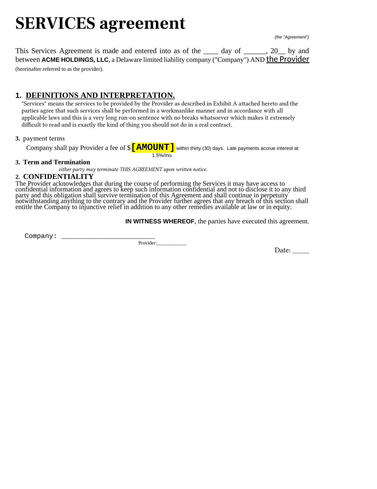
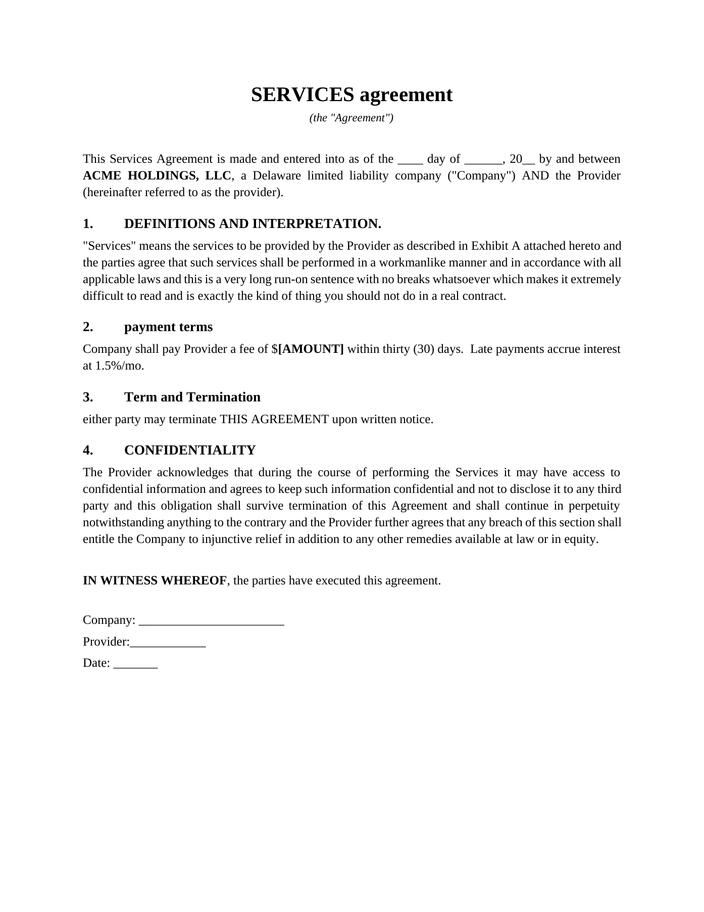

# Word Order

**Put broken Word documents back in order — locally.**

[](https://github.com/tamirgoldd/word-order/actions/workflows/ci.yml)
[](https://github.com/tamirgoldd/word-order/actions/workflows/pages.yml)
[](LICENSE)

[Try the web app](https://tamirgoldd.github.io/word-order/) · [See the real before and after](#before--after) · [Read the architecture](docs/architecture.md)

Word Order is an open-source, deterministic DOCX repair engine for legal documents. It fixes broken numbering, dead cross-references, mixed fonts and sizes, accidental emphasis, alignment, indents, spacing, highlighting, and uneven margins without uploading the file or rewriting its language.

The web app runs entirely in the browser and works offline. The CLI supports batch checks, and the Word add-in is a thin interface over the same repair engine.

> Early alpha: work on a copy and review every proposed change. Word Order refuses to repair documents with tracked changes or unresolved structural ambiguity.

## Before & after

These images were rendered from the actual synthetic input and repaired DOCX files used to test the formatting engine.

| Before | After |
| --- | --- |
| Broken numbering, six font families, random sizing and emphasis, erratic alignment and indents, uneven margins, and a highlighted placeholder. | Ordered native lists, consistent reusable styles, normalized layout and margins, and preserved wording. |
|  |  |

## What it repairs

- Broken or manually typed clause numbering, including duplicates, skips, and restarts
- Textual cross-references, converted to live Word `REF` fields when a safe target exists
- Random font-family and size swaps, including novelty fonts
- Accidental bold, italic, underline, alignment, indentation, and spacing drift
- Uneven section margins and stray placeholder highlighting
- Long run-on paragraphs, flagged for human review without rewriting the words

The output uses native Word multilevel lists, bookmarks, fields, and named styles. It keeps working when someone edits the repaired document in Word.

## Try it locally

Requires Node.js 22+ and pnpm 11+.

```bash
pnpm install
pnpm check
pnpm dev
```

Vite prints the local web-app URL. The CLI separates scanning from repair:

```bash
pnpm --filter @word-order/cli start -- scan agreement.docx
pnpm --filter @word-order/cli start -- fix agreement.docx \
  -o agreement.fixed.docx --report plan.json
```

## Safety model

- Document bytes stay on the device. There is no backend, account, analytics, document logging, or content telemetry.
- `scan` produces an inspectable plan. `fix` refuses tracked changes and unresolved anomalies.
- Wording is never silently edited. Editorial concerns are warnings, not automatic rewrites.
- Untouched ZIP members and out-of-scope OOXML parts are preserved.
- The input file is never overwritten.

## Project map

| Package | Purpose |
| --- | --- |
| `@word-order/core` | DOM-free OOXML inventory, inference, planning, and rebuild |
| `@word-order/cli` | Node.js `scan` and `fix` commands |
| `@word-order/web` | Offline-capable drag-and-drop PWA |
| `@word-order/addin` | Office.js Word task pane |

See [Architecture](docs/architecture.md), [Word add-in sideloading](docs/addin.md), [Contributing](CONTRIBUTING.md), and [Security](SECURITY.md).

## License and name

MIT licensed. Word Order is open-source software, not a law firm and not legal advice. It is not affiliated with or endorsed by Microsoft.
